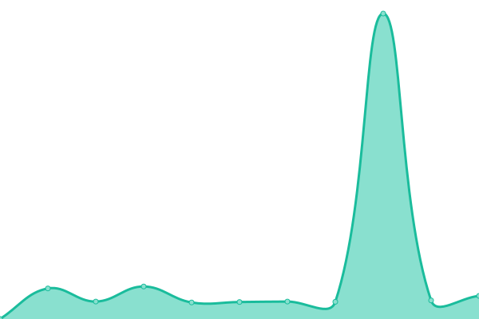

# [📈 Live Status](https://status.campa.tools): <!--live status--> **🟧 Partial outage**

This repository contains the open-source uptime monitor and status page for [Jonas Zürcher](https://www.sp-ps.ch), powered by [Upptime](https://github.com/upptime/upptime).

With [Upptime](https://upptime.js.org), you can get your own unlimited and free uptime monitor and status page, powered entirely by a GitHub repository. We use [Issues](https://github.com/tsueri/upptime/issues) as incident reports, [Actions](https://github.com/tsueri/upptime/actions) as uptime monitors, and [Pages](https://status.campa.tools) for the status page.

<!--start: status pages-->
<!-- This summary is generated by Upptime (https://github.com/upptime/upptime) -->
<!-- Do not edit this manually, your changes will be overwritten -->
<!-- prettier-ignore -->
| URL | Status | History | Response Time | Uptime |
| --- | ------ | ------- | ------------- | ------ |
|  [tsueri.cloud](https://tsueri.cloud) | 🟥 Down | [tsueri-cloud.yml](https://github.com/tsueri/upptime/commits/HEAD/history/tsueri-cloud.yml) | 

 898ms
     
 | 

<a href="https://status.campa.tools/history/tsueri-cloud">98.50%</a>
    

|  Online Document Editor | 🟩 Up | [online-document-editor.yml](https://github.com/tsueri/upptime/commits/HEAD/history/online-document-editor.yml) | 

 1002ms
     
 | 

<a href="https://status.campa.tools/history/online-document-editor">100.00%</a>
    

|  [social.tsueri.cloud (Mastodon)](https://social.tsueri.cloud/health) | 🟩 Up | [social-tsueri-cloud-mastodon.yml](https://github.com/tsueri/upptime/commits/HEAD/history/social-tsueri-cloud-mastodon.yml) | 

 883ms
     
 | 

<a href="https://status.campa.tools/history/social-tsueri-cloud-mastodon">80.12%</a>
    

|  [Mailserver](email.campa.tools) | 🟩 Up | [mailserver.yml](https://github.com/tsueri/upptime/commits/HEAD/history/mailserver.yml) | 

 120ms
     
 | 

<a href="https://status.campa.tools/history/mailserver">100.00%</a>
    

|  [Webserver](https://web2.campa.tools) | 🟩 Up | [webserver.yml](https://github.com/tsueri/upptime/commits/HEAD/history/webserver.yml) | 

 1473ms
     
 | 

<a href="https://status.campa.tools/history/webserver">100.00%</a>
    

|  DNS 1 | 🟩 Up | [dns-1.yml](https://github.com/tsueri/upptime/commits/HEAD/history/dns-1.yml) | 

 121ms
     
 | 

<a href="https://status.campa.tools/history/dns-1">100.00%</a>
    

<!--end: status pages-->

[**Visit our status website →**](https://status.campa.tools)

## 📄 License

- Powered by: [Upptime](https://github.com/upptime/upptime)
- Code: [MIT](./LICENSE) © [Jonas Zürcher](https://www.sp-ps.ch)
- Data in the `./history` directory: [Open Database License](https://opendatacommons.org/licenses/odbl/1-0/)
